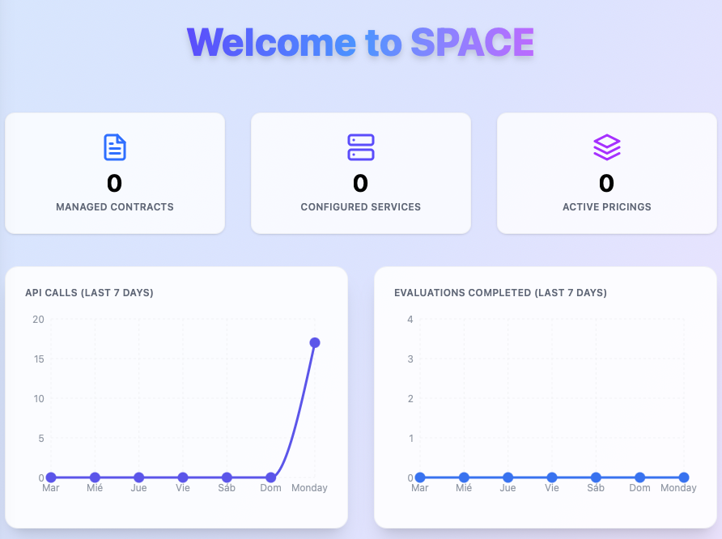

# SPACE: Subscription and Pricing Access Control Engine


## Table of Contents

1. [Introduction](#introduction)
2. [Running with Docker](#running-with-docker)
3. [Instance Configuration](#instance-configuration)
4. [Development Setup](#development-setup)
5. [Tech Stack](#tech-stack)
6. [Disclaimer & License](#disclaimer--license)

## Introduction

SPACE is a modular platform for managing users, services, contracts, and pricing strategies for SaaS applications. It provides a modern, animated dashboard UI, user and service management, analytics, and settings, all with full dark mode support. The backend exposes RESTful APIs and analytics endpoints.

## Running with Docker

1. **Prerequisites:**
   - [Docker](https://www.docker.com/) and [Docker Compose](https://docs.docker.com/compose/) installed.

2. **Clone the repository & run the application:**

   ```sh
   git clone https://github.com/Alex-GF/space.git
   cd space
   docker-compose up -d
   ```

   This will launch MongoDB, Redis, the backend API, the frontend client, and Nginx as a reverse proxy.

Then point your browser to [http://localhost:5403](http://localhost:5403), you should see this page: 


Then log using:

- **Username:** `admin`
- **Password:** `space4all`

and you will be redirected to this page:



## Instance Configuration

In many cases, you may want to configure your SPACE instance to meet your specific needs while protecting your business secrets.

To do so, you can modify the environments of both the **server and client services** within the `docker-compose.yml` file that is located in the root directory of the repository.

The full documentation for each environment can be located in the corresponding `.env.example` files in the `api/` and `frontend/` directories, respectively.

> [!CAUTION]
> For **real-world applications** integrating SPACE, it's very important to change both the `JWT_SECRET` and `JWT_SALT`environment variables of the `server`service. This is because all pricing tokens generated by SPACE are signed using these values, and if they are not changed, anyone with access to the source code can generate valid tokens for any user, which could lead to unauthorized access to your services.

## Development Setup

1. **Clone the repository**

```sh
git clone https://github.com/Alex-GF/space.git
cd space
```

2. **Install dependencies**
   
```sh
npm i
```

> [!TIP]
>We recommend using [pnpm](https://pnpm.io/) for package management, as it is faster and more efficient than npm or yarn. If you don't have pnpm installed, you can install it globally:
>
> ```sh
> npm install -g pnpm
> ```
>
> Then run:
>
> ```sh
> pnpm install
> ```
>
> This will install all dependencies for both the backend and frontend.

3. **Configure environment**

For development purposes, SPACE can be configured using a `.env` file in both the `api/` and `frontend/` directories. Inside each one you'll find a `.env.example` file that you can use to configure your `.env` as desired.

> [!TIP]
> If you don't care about the `.env` file configuration. You can also run: 
>
> ```sh
> pnpm run dev:setup:test
> ```
>
> This will create both `.env` files in the `api/` and `frontend/` directories with default values for development.

4. **Start the development instance**

To run SPACE in development mode, you can just run:

```sh
pnpm run dev
```

to start both the backend and frontend servers concurrently.

## Tech Stack

<div align="center">

| Frontend         | Backend         | Tooling & DevOps      | Other                |
|------------------|----------------|-----------------------|----------------------|
|  |  |  |  |
|  |  |  |  |
|  |  |  |  |

</div>

## Disclaimer & License

> **LICENSE**  
> This project is licensed under the MIT License. See [LICENSE](./LICENSE) for details

> **DISCLAIMER**
> This tool is part of ongoing research by the [ISA group](https://github.com/isa-group) in pricing-driven development and operation of SaaS. It is in a **very early stage** and is not intended for production use. The ISA group does not accept responsibility for any issues or damages that may arise from its use in real-world environments